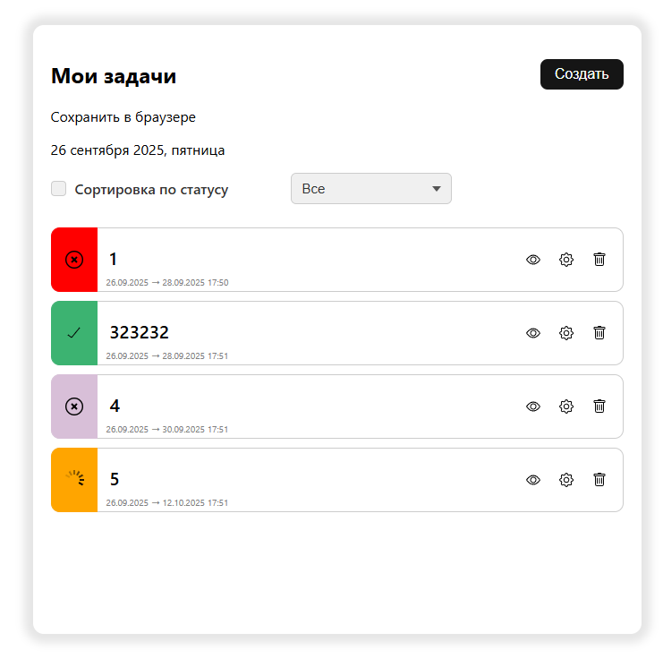
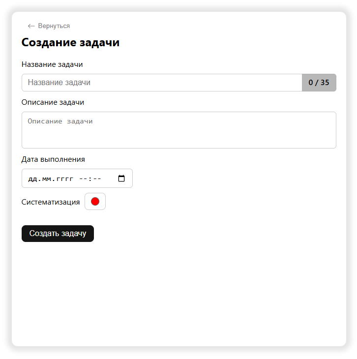

# TODO-list
Достаточно простенький TODO-list. Использовался zustand для управления состоянием. Применялся больше как для практики.

Сохраняет все задачи в локальном хранилище.

# Скриншотики
### Мои задачи

### Создание задачи

# Функционал
- Добавление задачи
- Редактирование задачи (Название и Описание)
- Удаление задачи
- Сортировка по статусу
- Фильтрация
- Систематизация по цветам (при создании задачи можно выбрать цвет)

# Используемые технологии
- React
- Zustand